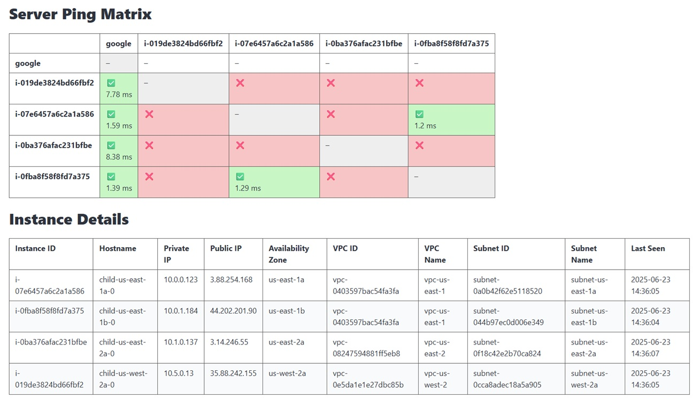

# Overview

I was playing with and testing a bunch of AWS things:
- Terraform
- Routing policies
- Security Groups
- NACLs
- VPC Peering
- ...and other networking related aspects...

Throughout this process, I realized how difficult it might be for those without a strong networking background, or perhaps those where networking simply isn't core to your role, to really appreciate and understand how _networks works_ in practice on AWS.

So, I threw this _mini-app_ together to try and provide a way for people to experiment and visualize changes in their AWS environment.

At a _high-level_ the Terraform script will deploy:
- A single 'master' server
- Multiple 'child' servers

The 'master' server runs a local MySQL database to collect and report on metrics from the 'child' servers. The 'master' server also runs a local web application (port 80) to show the status of all the _children_.

The 'child' servers will pull a list of _active_ servers from the 'master' server, and periodically (every 30 seconds) try to PING them. Those results will be reported back to the 'master' server.

For this to work properly, all 'child' servers need to be able to reach the 'master' server.

# Making It Work

Assuming you're familiar with Terraform and have proper access to your AWS environment, you can simply run (in the ```terraform``` folder):

```terraform init```

```terraform apply```

By default it will deploy the 'master' server to us-east-1, a 'child' server to us-east-1 and a second 'child' server to us-east-2.

The module definitions for us-east-2 and us-west-2 have been commented out within the Terraform script.

If you uncomment those module definitions it will deploy a single 'child' to each region.

You can obviously expand on this (add regions, add servers, add subnets, etc.), and in general that will require:
- Adding the associated provider to the 'main.tf' file for that region (copy/paste/small updates)
- Adding the associated module block to the 'main.tf' file for that region (copy/paste/small updates)
- Ensuring the 'vpcs' variable in variables.tf' reflects the environment you want

Once deployed, you can access the wesite (Terraform will output the link) on the 'master' server, and you'll get something like this:

</a>

From there you could test environment changes to see what can/can't _talk to eachother_:
- Create a VPC peering connection
- Update routing tables
- Change Security Groups or NACLs
- Add Transit Gateway
- ...and so on...